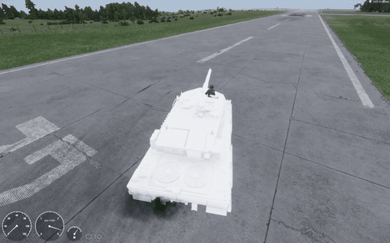

# Arma Reforger — Guia da esteira nativa

> [🇬🇧 English](README.md) · 🇧🇷 Português



*Giro no lugar com a simulação de esteira nativa (teste do Leopard 2A7, modelo sem textura). Mais em [Exemplos em vídeo](docs/pt-BR/05-video-examples.md).*

Um guia completo e testado do recurso de **veículo de esteira nativo** do Arma Reforger
(`TrackedVehicle_Base` e `VehicleTrackedSimulation`): o que é, como funciona por dentro
e como colocá-lo no seu próprio tanque, passo a passo.

Tudo aqui foi descoberto e testado durante a construção de um mod do **Leopard 2A7**, só
com o jogo base. Esse mod é o exemplo usado em todo o guia, e futuramente entra neste
repositório como exemplo completo.

**Testado em:** Arma Reforger / Enfusion Workbench **1.8.0.13** (outubro de 2026).

## Por que existe

O jogo base traz uma simulação de esteira, mas nenhum veículo vanilla a usa e a
configuração padrão nem carrega. Os mods de tanque publicados imitam a esteira com a
simulação de rodas. Este guia documenta o sistema de verdade, com os bugs e os contornos,
para o próximo modder não ter que fazer engenharia reversa de novo.

## O que funciona

| Recurso | Situação |
| --- | --- |
| Andar para a frente, marchas automáticas, velocidade máxima | ✅ Funciona (Leopard: ~74 km/h medidos) |
| Virar andando | ✅ Funciona |
| Girar no lugar | ✅ Funciona |
| Ré | ⚠️ A ré nativa está quebrada na 1.8.0.13 — resolvida com um script pequeno ([por quê](docs/pt-BR/09-bugs.md)) |
| Animação das esteiras e rodas | ❌ O sistema nativo não entrega pronta |
| Multiplayer | ⚠️ Ainda não testado; a ré por script hoje só roda na máquina do motorista |

## Conteúdo

| # | Capítulo |
| --- | --- |
| 0 | [Sobre este guia](docs/pt-BR/00-about.md) |
| 1 | [Visão geral](docs/pt-BR/01-overview.md) |
| 2 | [Arquitetura](docs/pt-BR/02-architecture.md) |
| 3 | [Requisitos do modelo 3D](docs/pt-BR/03-model-requirements.md) |
| 4 | [Passo a passo do zero](docs/pt-BR/04-from-scratch.md) |
| 5 | [Exemplos em vídeo](docs/pt-BR/05-video-examples.md) |
| 6 | [Converter um veículo existente](docs/pt-BR/06-converting.md) |
| 7 | [Referência de atributos](docs/pt-BR/07-attribute-reference.md) |
| 8 | [Como funciona por dentro](docs/pt-BR/08-internals.md) |
| 9 | [Bugs e limitações (1.8.0.13)](docs/pt-BR/09-bugs.md) |
| 10 | [Afinação com dados reais](docs/pt-BR/10-tuning.md) |
| 11 | [Scripts prontos](docs/pt-BR/11-scripts.md) |
| 12 | [Solução de problemas](docs/pt-BR/12-troubleshooting.md) |
| 13 | [Apêndice](docs/pt-BR/13-appendix.md) |

## Começo rápido

1. Faça o prefab do casco herdar de `{0608D8FA71FD3433}Prefabs/Vehicles/Core/TrackedVehicle_Base.et`.
2. Preencha o bloco `Simulation Tracked`: curvas de atrito, modelos de roda e exatamente duas esteiras
   ([capítulo 4](docs/pt-BR/04-from-scratch.md); um bloco completo e funcionando está em
   [examples/leopard2a7](examples/leopard2a7/VehicleTrackedSimulation_Leopard2A7.et.txt)).
3. Adicione o [`LEO_TrackedReverseComponent`](scripts/LEO_TrackedReverseComponent.c) para a ré andar de
   verdade, e use `ThrottleReverseTarget 1` no controlador.

## Estrutura do repositório

```
docs/en/        capítulos em inglês
docs/pt-BR/     capítulos em português (mesmos nomes de arquivo)
docs/images/    fotos e GIFs do vídeo de teste
scripts/        componentes em Enforce Script (ré por script, telemetria)
examples/       o exemplo do Leopard 2A7 (bloco do prefab agora, mod completo depois)
```

## Créditos

- **Modelo 3D:** ["Leopard 2 A7"](https://sketchfab.com/3d-models/leopard-2-a7-b29d1cb2e65e4fa8a6e99f88e11b013b),
  de [king_st0ne](https://sketchfab.com/kingstonlee96), sob a licença
  [CC BY-SA 4.0](https://creativecommons.org/licenses/by-sa/4.0/). Veja [CREDITS.md](CREDITS.md).
- **Guia, pesquisa e scripts:** Kiichi.

## Licença

| O quê | Licença |
| --- | --- |
| Documentação e imagens (`docs/`, READMEs) | [CC BY-SA 4.0](LICENSE-docs) |
| Código (`scripts/`, trechos de prefab e código em `examples/`) | [MIT](LICENSE) |
| Modelo 3D e tudo que for derivado dele | [CC BY-SA 4.0](https://creativecommons.org/licenses/by-sa/4.0/), crédito a king_st0ne |

Arma Reforger e Enfusion são marcas da Bohemia Interactive a.s. Este projeto não tem
vínculo com a Bohemia Interactive nem é endossado por ela.

## Como contribuir

Issues e pull requests são bem-vindos, principalmente resultados de versões novas do jogo.
Mantenha os capítulos em inglês e português sincronizados.
