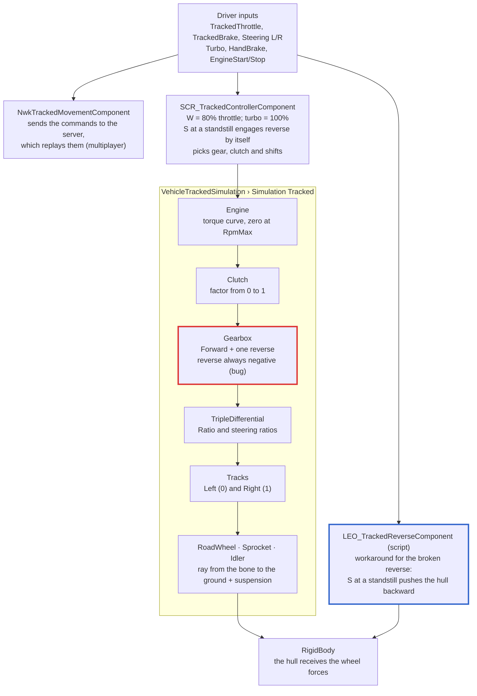

> [🇧🇷 Português](../pt-BR/02-architecture.md) · 🇬🇧 English

[← Overview](01-overview.md) · [Contents](../../README.md) · [3D model requirements →](03-model-requirements.md)

# Architecture

*Red border: the native reverse bug. Blue border: the script workaround.*

The driver never talks to the simulation directly. The controller reads the keys and decides throttle, brake, gear and clutch. The simulation computes the engine, drivetrain, tracks and wheels, and applies the forces to the hull.

Where each part lives in the prefab:

| Component | Where it lives | Role |
| --- | --- | --- |
| `VehicleTrackedSimulation` | Hull `components` | Track physics: engine, drivetrain, tracks, wheels |
| `SCR_TrackedControllerComponent` | Inside `BaseVehicleNodeComponent` | Turns the keys into pedals, gear and clutch |
| `NwkTrackedMovementComponent` | Hull `components` | Replicates movement in multiplayer |
| `RigidBody` | Hull `components` | Mass, center of mass and collision |
| `SCR_WheeledDamageManagerComponent` | Hull `components` | Damage: hull, engine, gearbox, wheels |
| `SignalsSourceAccess` | Inside `VehicleTrackedSimulation` (comes from the `.ct`) | Links the simulation to the `engineRPM`, `engineThrust`, etc. signals |

All of them come ready-made in `TrackedVehicle_Base.et`. What is left is to fill in the simulation, as the [step-by-step guide](04-from-scratch.md) shows.

---

[← Overview](01-overview.md) · [Contents](../../README.md) · [3D model requirements →](03-model-requirements.md)
