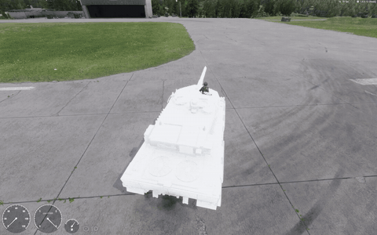

> [🇧🇷 Português](../pt-BR/09-bugs.md) · 🇬🇧 English

[← How it works inside](08-internals.md) · [Contents](../../README.md) · [Tuning with real-world data →](10-tuning.md)

# Bugs and limitations in version 1.8.0.13

All items below were reproduced in Workbench 1.8.0.13. Future versions may fix some of them; test again after each update.

### Summary

| Problem | Symptom | Workaround |
| --- | --- | --- |
| **Native reverse is broken** | The engine climbs above `RpmMax` and the tank does not move. On a downhill, only gravity moves it | Script that pushes the hull ([Ready-made scripts](11-scripts.md) section) + `ThrottleReverseTarget 1` |
| `ThrottleReverseTarget` below 1 | When you hold S while stopped, the tank moves **forward** | Use `ThrottleReverseTarget 1` |
| Incomplete vanilla `.ct` | `Tracked - failed to load!` | Add friction curves, wheel templates and tracks |
| Default retarder | Top speed locked at \~51–54 km/h | `RetarderBaseTorque 0`, `RetarderThrottleSpeed 20` |
| `ThrottleTurbo` 0.2 | W alone gives only 80% throttle | Use the turbo or lower `ThrottleTurbo` |
| `VehicleTrackedSimulation.GetInputs()` | Workbench **crash** when called from script | Never call it. `GetFloorNormalAngles()` has the same defect |
| *Show vehicle debug* / *Show Controller Diags* diag | **Crash** when opened with a tracked vehicle | Do not use these diags if there is no visual link chain |
| `GetThrottle()`, `SetThrottle()`, `IsHandbrakeOn()` | Always 0, does nothing, always false | Read the `engineThrust` signal or use `GetGear()` and `GetClutch()` |
| `MaxClutchTorque` | Changing the value changes nothing | Ignore it |
| Visual link chain | The default asset (M113 link) does not ship with the game | Static track in the model, or your own animation |
| Reloading scripts during *Play* | Workbench **crash** | Stop *Play* before reloading |
| `AICarMovementComponent` in the vanilla base | Warning that `CarControllerComponent` is missing | Harmless for manual driving |
| Reverse push by script | In multiplayer, it only runs on the driver's machine | Pending: run it on the server or send it by RPC |

### Reverse in detail

The controller works. It selects reverse (gear 0), engages the clutch and accelerates. The defect is in the simulation.

The load reaction is divided by the gear ratio. The reverse ratio is always negative, so the reaction **adds** RPM instead of removing it. The RPM goes past `RpmMax`, where the torque is zero. No torque reaches the tracks.

The RPM gets stuck at `RpmMax + Δ`, and you can calculate Δ:

```math
\Delta = \frac{\text{Mass} \cdot 9.81 \cdot \frac{1}{240} \cdot \frac{30}{\pi}}{|\text{Reverse}| \cdot \text{Ratio} \cdot \text{Inertia}}
```

The prediction matches the Leopard telemetry (64500 kg, `RpmMax` 3000, `Ratio` 4.9):

| Inertia | Reverse | Predicted | Observed |
| --- | --- | --- | --- |
| 6 | 4.0 | 3214.08 rpm | 3214.08–3214.10 rpm |
| 3 | 2.3 | 3744.64 rpm | 3744.63–3744.73 rpm |

**No prefab value fixes this.** The differential `Ratio` must be positive, and the reverse sign is forced. The clutch, `TransmissionRND` and `ClutchCouple*Rpm` change nothing.

With `ThrottleReverseTarget` below 1, the engine produces negative torque. Multiplied by the negative ratio, it pushes the tank forward.

### The workaround used on the Leopard

A script component applies a backward force to the hull when:

- the local driver holds `TrackedBrake` without throttle;
- the engine is running;
- the hull is stopped or already moving backward;
- the native gear is reverse or neutral (index ≤ 1);
- the native brake is released (signal below 0.05).

The force fades to zero near the maximum reverse speed. There is also a yaw torque for turning in reverse. Measured result: from 0 to −21 km/h in about 3 s.



*The scripted reverse in the test video, turning while backing up. More in [Video examples](05-video-examples.md).*

Keep the script's reverse speed below the native reverse cap:

```math
v_{\text{max,rev}}\,[\text{km/h}] = \frac{\text{RpmMax}}{|\text{Reverse}| \cdot \text{Ratio}} \cdot \frac{2\pi}{60} \cdot r_{\text{sprocket}} \cdot 3.6
```

On the Leopard: 3000 / (2.3 · 4.9) · 0.10472 · 0.355 · 3.6 ≈ 35.6 km/h. The script stops at 31 km/h.

### Another option: wheeled simulation

Published tank mods use `VehicleWheeledSimulation` with one axle per wheel pair. Turning comes from steering axles (+15° at the front, −15° at the rear), like on a car. Reverse works, but the behavior is less faithful than the native tracked system with the reverse script.

---

[← How it works inside](08-internals.md) · [Contents](../../README.md) · [Tuning with real-world data →](10-tuning.md)
