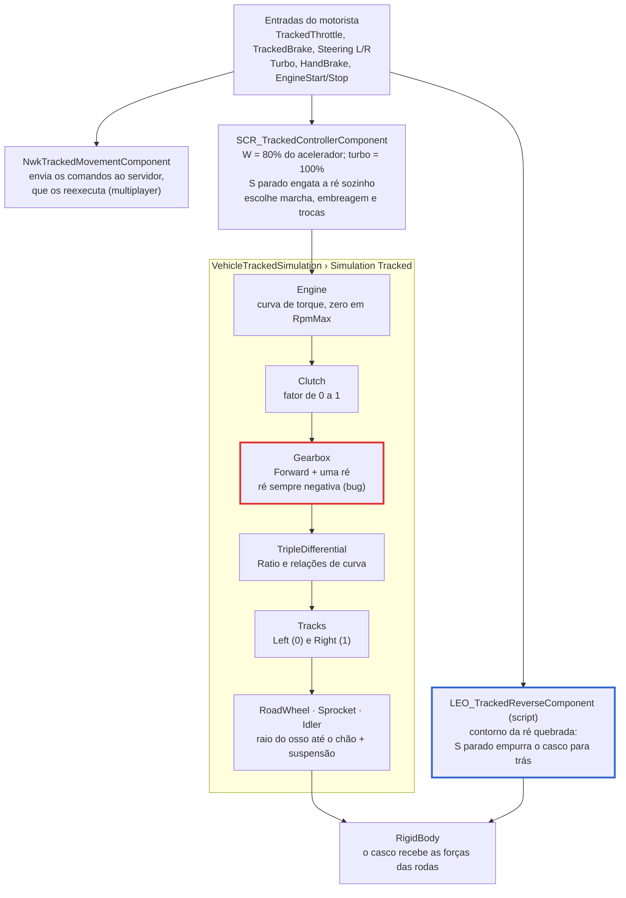

> 🇧🇷 Português · [🇬🇧 English](../en/02-architecture.md)

[← Visão geral](01-overview.md) · [Índice](../../README.pt-BR.md) · [Requisitos do modelo 3D →](03-model-requirements.md)

# Arquitetura

*Borda vermelha: bug da ré nativa. Borda azul: contorno por script.*

O motorista nunca fala direto com a simulação. O controlador lê as teclas e decide acelerador, freio, marcha e embreagem. A simulação calcula motor, transmissão, esteiras e rodas, e aplica as forças no casco.

Onde cada peça mora no prefab:

| Componente | Onde fica | Papel |
| --- | --- | --- |
| `VehicleTrackedSimulation` | `components` do casco | Física da esteira: motor, transmissão, esteiras, rodas |
| `SCR_TrackedControllerComponent` | Dentro de `BaseVehicleNodeComponent` | Traduz as teclas em pedais, marcha e embreagem |
| `NwkTrackedMovementComponent` | `components` do casco | Replica o movimento em multiplayer |
| `RigidBody` | `components` do casco | Massa, centro de massa e colisão |
| `SCR_WheeledDamageManagerComponent` | `components` do casco | Dano: casco, motor, câmbio, rodas |
| `SignalsSourceAccess` | Dentro do `VehicleTrackedSimulation` (vem do `.ct`) | Liga a simulação aos sinais `engineRPM`, `engineThrust` etc. |

Todos vêm prontos do `TrackedVehicle_Base.et`. O que falta é preencher a simulação, como mostra o [passo a passo](04-from-scratch.md).

---

[← Visão geral](01-overview.md) · [Índice](../../README.pt-BR.md) · [Requisitos do modelo 3D →](03-model-requirements.md)
