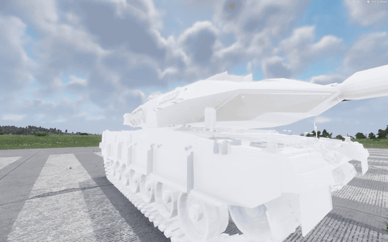
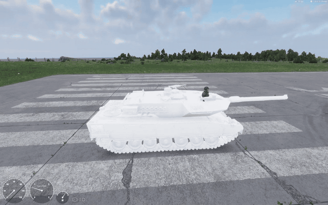
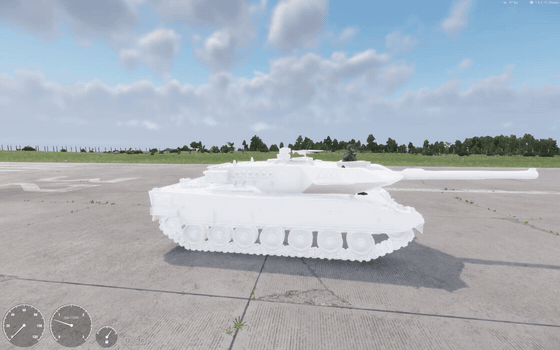
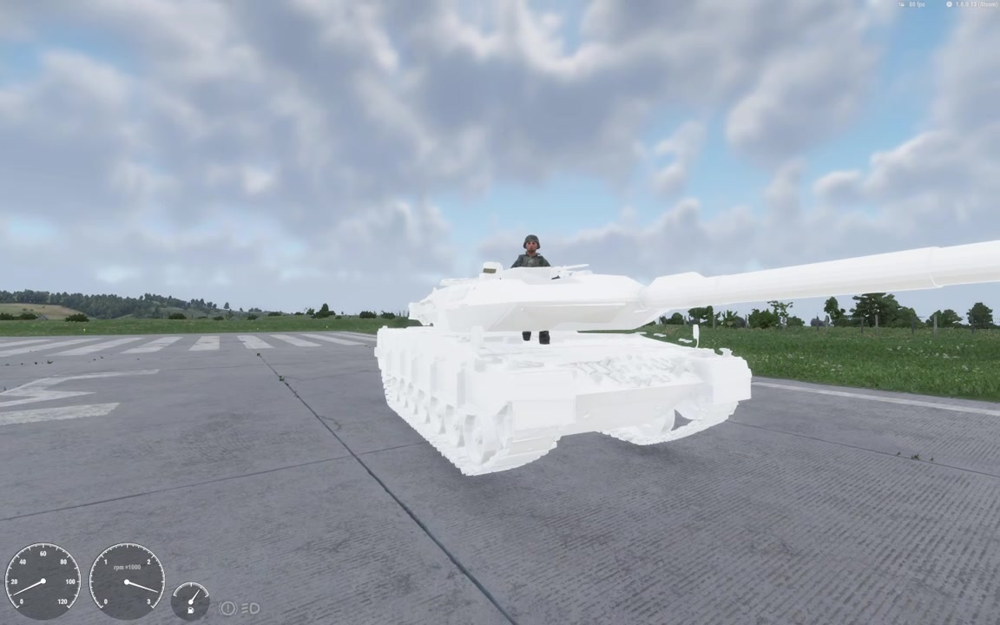
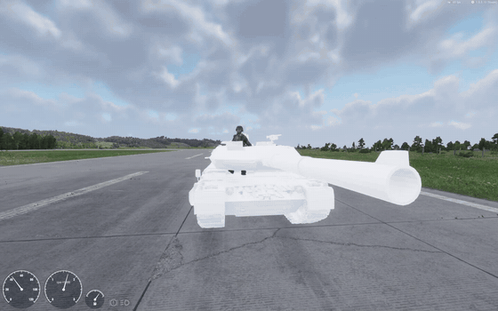
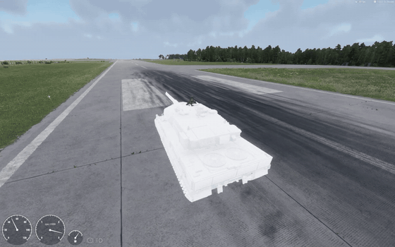
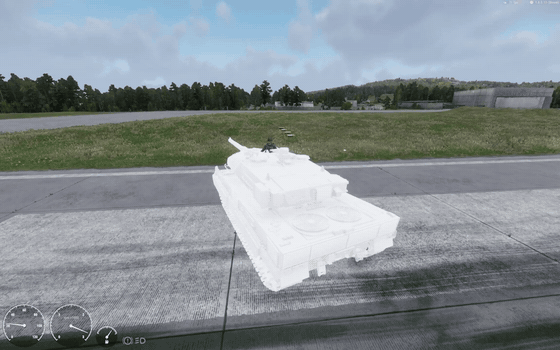
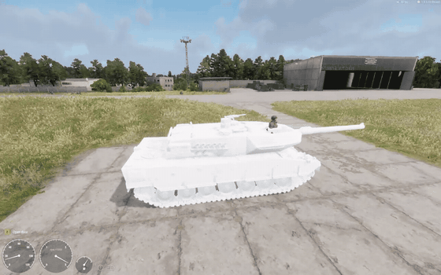

> 🇧🇷 Português · [🇬🇧 English](../en/05-video-examples.md)

[← Passo a passo do zero](04-from-scratch.md) · [Índice](../../README.pt-BR.md) · [Converter um veículo existente →](06-converting.md)

# Exemplos em vídeo

Estes exemplos vêm de um teste de 2 min 13 s do mod do Leopard 2A7, gravado no Workbench 1.8.0.13, na pista do aeródromo do mapa Arland. O modelo ainda está sem textura. Cada exemplo tem um GIF curto (ou uma foto) e o momento exato do vídeo original.

**Como ler o painel.** No canto inferior esquerdo ficam três mostradores: o velocímetro à esquerda (km/h, até 120), o conta-giros no meio (rpm × 1000, até 3) e o combustível à direita.

Todos os momentos de ré, giro no lugar, grama e curva foram conferidos quadro a quadro contra o chão (marcas da pista, rachaduras, grama), não contra a câmera, que o jogador gira livremente.

## Resumo

| Exemplo | Tempo no vídeo | Ilustra |
| --- | --- | --- |
| [Entrando como motorista](#enter-driver) | 3,75–8,25 s | [Passo a passo do zero](04-from-scratch.md) |
| [Arrancada para frente](#accelerate-forward) | 14,75–19,25 s | [Afinação com dados reais](10-tuning.md) |
| [Ré por script](#scripted-reverse) | 27,75–31,75 s | [Bugs e limitações](09-bugs.md) |
| [Giro no lugar](#pivot-in-place) | 37–42 s | [Como funciona por dentro](08-internals.md) |
| [Ré com esterçamento](#reverse-steering) | 45,25–50,25 s | [Bugs e limitações](09-bugs.md) |
| [Modelo sem textura e tripulante atravessando a torre](#crew-clipping) | 58 s | [Bugs e limitações](09-bugs.md) |
| [Corrida longa pela pista](#runway-run) | 73,5–77,75 s | [Afinação com dados reais](10-tuning.md) |
| [Esterçamento em movimento](#steer-while-moving) | 77,5–81 s | [Como funciona por dentro](08-internals.md) |
| [Saindo do asfalto para a grama](#offroad-grass) | 84,75–88,75 s | [Referência de atributos](07-attribute-reference.md) |
| [Rodas e esteiras sem animação](#static-tracks) | 110,6–113,6 s | [Bugs e limitações](09-bugs.md) |

## Entrando como motorista

Close do modelo Leopard 2A7 branco, sem textura, com o prompt 'Get in: Driver' na frente direita do casco. Não há animação de embarque: a visão corta direto para o assento do motorista em primeira pessoa, depois aparecem os medidores do veículo e a câmera passa para terceira pessoa.

*Vídeo: 3,75–8,25 s · [foto em tamanho cheio](../images/enter-driver.jpg) (5 s) · Ilustra: [Passo a passo do zero](04-from-scratch.md)*

## Arrancada para frente

Com o motor em marcha lenta, o tanque sai da imobilidade e anda para frente pela pista (W), deixando fumaça de escapamento para trás. O velocímetro (medidor da esquerda) marca cerca de 13 km/h neste quadro; a arrancada chega a cerca de 30 km/h por volta de 22,5 s, com trocas de marcha visíveis no ponteiro de RPM.

*Vídeo: 14,75–19,25 s · [foto em tamanho cheio](../images/accelerate-forward.jpg) (16,5 s) · Ilustra: [Afinação com dados reais](10-tuning.md)*

## Ré por script

Segurar S com o tanque parado ativa a ré por script: o casco se desloca para trás (o piso da pista desliza em direção à frente do tanque enquanto a câmera fica fixa), sem mudar de direção. O ponteiro de RPM fica no topo da escala e o velocímetro marca cerca de 16 km/h neste quadro, chegando a cerca de 20 km/h antes de parar. O velocímetro não indica que é ré.

*Vídeo: 27,75–31,75 s · [foto em tamanho cheio](../images/scripted-reverse.jpg) (29,5 s) · Ilustra: [Bugs e limitações](09-bugs.md)*

## Giro no lugar

Giro no lugar (neutral steer): com o tanque parado, o casco gira para a esquerda sem sair do lugar (A com o tanque parado). A câmera fica travada atrás do tanque enquanto os números pintados na pista giram ao redor dele a uma distância quase constante; o casco gira cerca de 180 graus entre 35,6 s e 44,9 s com o velocímetro em 0. Durante parte do giro o ponteiro de RPM cai para a marcha lenta.

*Vídeo: 37–42 s · [foto em tamanho cheio](../images/pivot-in-place.jpg) (40 s) · Ilustra: [Como funciona por dentro](08-internals.md)*

## Ré com esterçamento

Ré por script com esterçamento. Partindo da imobilidade, o tanque recua (as letras pintadas na pista surgem por trás da câmera e deslizam para frente ao longo do lado direito do casco), chegando a cerca de 17 km/h, e depois o casco gira para a esquerda enquanto continua andando para trás. O velocímetro não chega a 0 durante a manobra, e o ponteiro de RPM alterna entre o topo da escala e a marcha lenta.

*Vídeo: 45,25–50,25 s · [foto em tamanho cheio](../images/reverse-steering.jpg) (47,25 s) · Ilustra: [Bugs e limitações](09-bugs.md)*

## Modelo sem textura e tripulante atravessando a torre

Vista frontal do casco e da torre sem textura durante a condução para frente. O tripulante em pé na escotilha da torre aparece com as botas visíveis abaixo da torre, no vão entre a torre e o teto do casco: a parte inferior do personagem atravessa o piso da torre.

*Vídeo: 58 s · Ilustra: [Bugs e limitações](09-bugs.md)*

## Corrida longa pela pista

Corrida longa para a frente pela pista, com a câmera orbitando o tanque em movimento (frente, lado direito, traseira). O velocímetro marca cerca de 50 km/h em 77,5 s, a maior velocidade deste vídeo; em outro teste, a máxima medida foi ~74 km/h. O canhão fica alinhado com o casco o tempo todo.

*Vídeo: 73,5–77,75 s · [foto em tamanho cheio](../images/runway-run.jpg) (77,5 s) · Ilustra: [Afinação com dados reais](10-tuning.md)*

## Esterçamento em movimento

Esterçamento em movimento: saindo da corrida rápida, o tanque freia e vira à direita no fim da pista. Com a câmera travada atrás do casco, a linha de árvores e o hangar atravessam a tela da direita para a esquerda. O velocímetro cai de cerca de 50 km/h para cerca de 11 km/h até 80,5 s.

*Vídeo: 77,5–81 s · [foto em tamanho cheio](../images/steer-while-moving.jpg) (78,75 s) · Ilustra: [Como funciona por dentro](08-internals.md)*

## Saindo do asfalto para a grama

Saindo do concreto para a grama ao lado da pista: a faixa branca da borda passa sob o casco e o tanque segue reto na grama, passando pelos marcadores amarelos da borda, a cerca de 25 km/h no velocímetro. O terreno aqui é plano, então não dá para ver movimento de suspensão.

*Vídeo: 84,75–88,75 s · [foto em tamanho cheio](../images/offroad-grass.jpg) (87 s) · Ilustra: [Referência de atributos](07-attribute-reference.md)*

## Rodas e esteiras sem animação

Vista lateral numa laje de concreto a cerca de 17 km/h no velocímetro, seguida de uma parada brusca. As juntas das placas deslizam sob o tanque enquanto as rodas e os elos da esteira ficam idênticos de um quadro para outro: rodas e esteiras não são animadas (malha estática). Um prompt 'Open door' aparece no HUD durante a condução.

*Vídeo: 110,6–113,6 s · [foto em tamanho cheio](../images/static-tracks.jpg) (111,2 s) · Ilustra: [Bugs e limitações](09-bugs.md)*

## O que o vídeo revela que ainda falta

O teste também mostrou problemas que não aparecem no log. Eles valem para qualquer tanque feito com este guia, não só para o Leopard.

| Problema | Onde aparece | Situação |
| --- | --- | --- |
| Rodas e esteiras não giram | 16,5 s · 29,5 s · 74,5 s · 110,6–111,7 s | Esperado: o sistema nativo não anima o modelo ([detalhes](06-converting.md)) |
| O painel não indica ré: o velocímetro mostra valor positivo e o conta-giros fica no topo | 28–31 s · 45,3–53,8 s | Efeito do bug da ré nativa ([detalhes](09-bugs.md)) |
| A ré por script chegou a ~20 km/h, abaixo dos 31 km/h configurados | 28–31 s · 45,3–48,5 s | A força cai com a velocidade; empurrões de ~3 s não chegam ao teto |
| No giro no lugar, o conta-giros cai para a lenta enquanto o casco ainda gira | 37,5–41,5 s · 113,5–115 s | Em aberto |
| Ação "Open door [Z]" oferecida ao motorista | 8–13,25 s · 107–111,5 s | Provavelmente herdada do modelo de veículo; em aberto |
| Sem animação de embarque: a visão corta direto para o banco | 5,3–5,5 s | Esperado com portas de teleporte (`GetInTeleport 1`) |
| Tripulante na escotilha atravessa o piso da torre (botas abaixo dela) | 57,75–66,25 s · 72,5–73,75 s | Posição do tripulante a corrigir |
| Ponto de visão do motorista na altura do teto da torre (pouca certeza) | 5,5–7,25 s | Câmera do motorista a corrigir |
| A grama atravessa a parte de baixo do casco | 90–107 s | Em aberto |
| A torre não gira em nenhum momento do vídeo | todo o vídeo | Não testado nesta gravação |

---

[← Passo a passo do zero](04-from-scratch.md) · [Índice](../../README.pt-BR.md) · [Converter um veículo existente →](06-converting.md)
